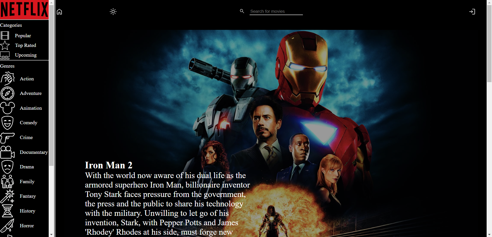
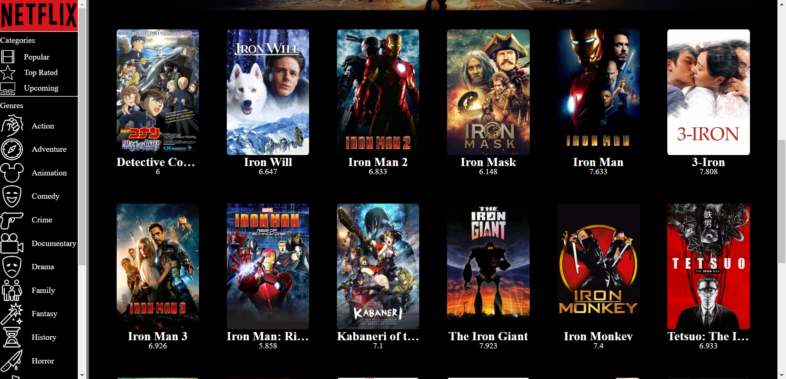
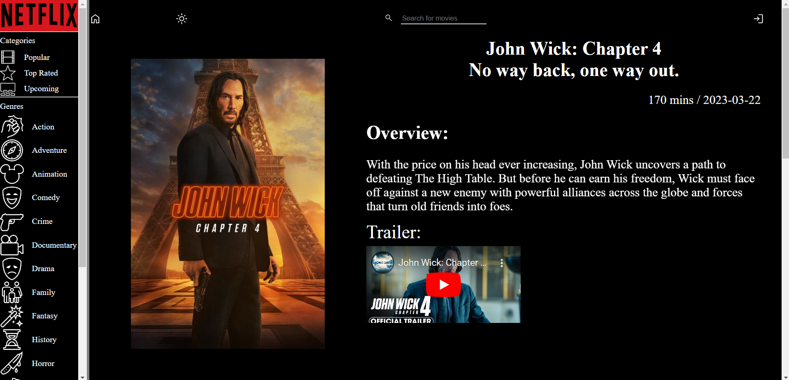
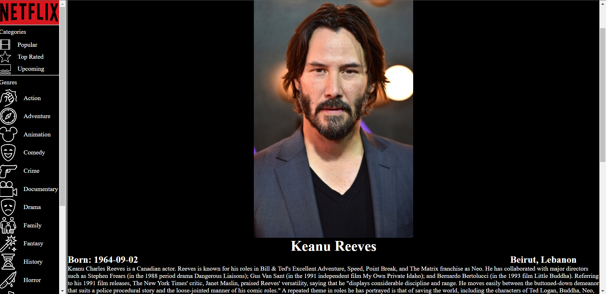
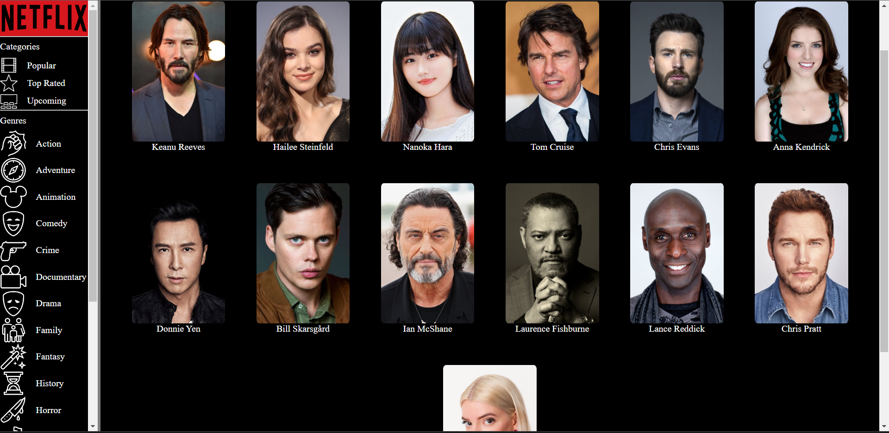
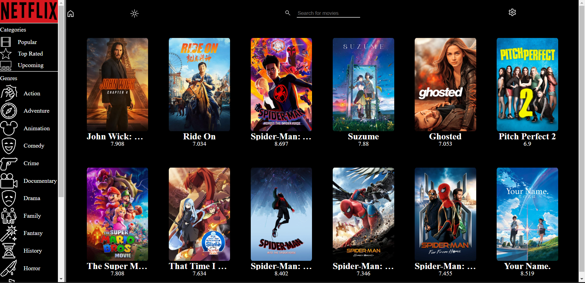

# Netflix Clone
Full MERN stack web app that uses the TMDB API 
to display movie and actor information.
Check it out [HERE](https://netflix-clone-one-pink.vercel.app/).

## Movie Banner

 

## Movie Results

 

## Movie Information

 

## Actor Information

 

## Favorite Actors

 

## Favorite Movies

 

# What I Learned
* Strategies for using React Hooks to create a responsive and fast web application.
* Implemented React Routers to simplify and quicken re-rendering of the page.
* Created Express middleware with node-cache to implement lazy-load caching and speed up render times.
* Approaches for decomposing, organizing, and constructing a large project.
* Implemented a basic CRUD API for MongoDB using Mongoose.